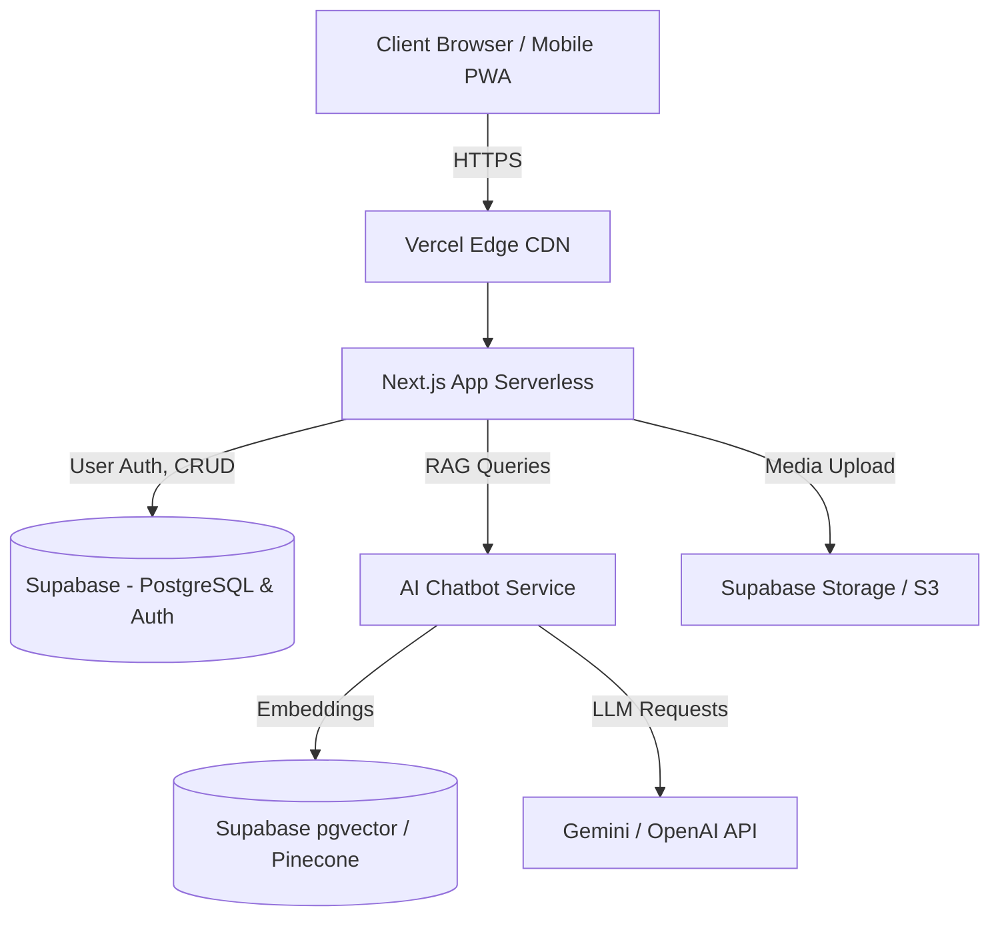

# Tài Liệu Kế Hoạch Kỹ Thuật (Technical Plan & Architecture) - Dự án Nihonseikatsu

**Ngày cập nhật:** 12/04/2026
**Dự án:** Nihonseikatsu
**Tham chiếu:** `01_BUSINESS_ANALYSIS.md`

---

## 1. Tổng quan Kiến trúc Hệ thống (System Architecture Overview)

Hệ thống được thiết kế theo kiến trúc **Serverless** kết hợp **Edge Computing** nhằm mang lại khả năng mở rộng nhanh chóng và tối ưu trải nghiệm người dùng (đặc biệt là tốc độ load trang trên thiết bị di động).

## 2. Chi tiết Công nghệ (Tech Stack)

### 2.1 Frontend
- **Framework:** Next.js (React 19) sử dụng *App Router* hỗ trợ linh hoạt Server-Side Rendering (SSR) cho các trang Thủ tục Hành chính (chuẩn SEO) và Client-Side Rendering (CSR) cho Chợ đồ cũ hoặc Chatbot.
- **Ngôn ngữ:** TypeScript để đảm bảo an toàn kiểu dữ liệu (Type-safety).
- **Styling:** Tailwind CSS kết hợp với `shadcn/ui` cho giao diện hiện đại, phát triển siêu tốc theo chuẩn Mobile-First.
- **State Management:** Zustand (Global State) + React Query (Data Fetching & Caching).
- **Image Optimization:** Sử dụng `<Image>` component của Next.js cho tài nguyên nội bộ và tự động nén cho listing ảnh C2C.

### 2.2 Backend & Cơ sở dữ liệu (BaaS)
- **Nền tảng chính:** Supabase (Cung cấp Authentication, Database, Real-time APIs, và Storage). Kiến trúc này giúp bỏ qua việc xây dựng một custom backend cho các CRUD cơ bản.
- **Cơ sở dữ liệu:** PostgreSQL (Relational DB) để đảm bảo tính toàn vẹn của dữ liệu giao dịch và thông tin người dùng.
- **Real-time:** Sử dụng tính năng Real-time của Supabase cho "Bảng tin thảo luận" (Event Groups) tạo trải nghiệm chat mượt mà.

### 2.3 Hệ thống AI (LLM & RAG)
Xây dựng Chatbot AI hỗ trợ giải đáp nhanh thủ tục pháp lý.
- **LLM Engine:** Gemini 1.5 Pro hoặc OpenAI GPT-4o.
- **Kiến trúc RAG (Retrieval-Augmented Generation):**
  - Sử dụng **LangChain.js** đễ quản lý pipeline trong Server Actions của Next.js.
  - Sử dụng **Vector DB:** `pgvector` (tích hợp trực tiếp trên Supabase) để lưu trữ embedding vectors các tài liệu luật pháp nhập khẩu từ Bộ Tư Pháp Nhật Bản giúp chatbot luôn trả về thông tin đúng sự thật (chống hallucination).

---

## 3. Lược Đồ Dữ Liệu Cốt Lõi (Core Database Schema)

Thiết kế cơ sở dữ liệu trên PostgreSQL / Supabase, gồm các nhóm bảng (Tables):

### 3.1. User Management (Quản lý User)
- `users`: `id`, `email`, `phone_number` (Nhật Bản nhằm chống fake accounts), `auth_provider`, `role`, `created_at`.
- `user_profiles`: `user_id`, `display_name`, `avatar_url`, `prefecture_id`, `visa_status`.

### 3.2. Administrative Hub (Thủ tục hành chính)
- `administrative_guides`: `id`, `title`, `category`, `content_md`, `seo_slug`, `last_verified_date`.
- `administrative_steps`: `id`, `guide_id`, `step_number`, `description`, `required_documents`.
- `document_templates`: `id`, `name`, `pdf_url`, `guide_id`.
- `guide_embeddings`: Bảng chứa vector nội dung của guides phục vụ AI (ứng dụng pgvector).

### 3.3. Events & Networking
- `events`: `id`, `title`, `description`, `location`, `date_time`, `organizer_id`.
- `event_groups`: `id`, `event_id`, `name`, `rules`, `member_count`.
- `group_messages`: `id`, `group_id`, `sender_id`, `content`, `timestamp` (Bật Real-time config).

### 3.4. Marketplace (Chợ đồ cũ)
- `marketplace_listings`: `id`, `seller_id`, `title`, `description`, `price_jpy`, `category_id`, `prefecture_id`, `status` (active/sold).
- `listing_images`: `id`, `listing_id`, `image_url`, `display_order`.
- `user_reviews`: `id`, `reviewer_id`, `reviewed_user_id`, `rating` (1-5), `comment`.

---

## 4. Giải pháp Kỹ thuật cho các Báo cáo Rủi Ro (Risk Mitigation Tech)

| Rủi ro (Từ BA Doc) | Giải pháp kỹ thuật tương ứng |
| :--- | :--- |
| **R1. Dữ liệu Luật bị cũ** | Xây dựng Dashboard cho Admin/Moderator cập nhật nội dung. Thiết lập *Webhook/Cronjob* tự động trigger Edge Function chạy lại embedding mỗi khi văn bản bị sửa đổi để lưu vào `pgvector`. |
| **R2. Lừa đảo trên chợ đồ cũ** | Yêu cầu user nhập/xác nhận SĐT qua OTP (Supabase Auth SMS) mới đượm cấp role "Verified" để tạo Listing. Thiết lập Rate-limiting (vd: 5 posts/giờ) để chống auto-spam. |
| **R3. Spam/Nội dung xấu trong Group**| Gọi API cho tác vụ Moderation (có thể sử dụng tính năng Text Moderation tích hợp có sẵn của Google Cloud hoặc OpenAI) trong Middleware trước khi lưu tin nhắn chat xuống Database. |
| **R4. Tối ưu SEO cho bài viết** | Sử dụng Next.js `generateMetadata()` tự động đọc Title/Description từ DB. Render `[slug].tsx` của thủ tục hành chính dưới dạng *React Server Components* (RSC). |

---

## 5. Chiến lược Triển khai & Bảo mật (Deployment & CI/CD Strategy)

- **Version Control:** Quản lý code trên GitHub với quy trình GitFlow (chuẩn Pull Request (PR) -> Main).
- **CI/CD Pipeline (GitHub Actions/Vercel):**
  1. Pipeline kiểm tra tự động lỗi Linting (ESLint), Format (Prettier) cùng System Type-check.
  2. Khi tạo PR, Vercel cung cấp ngay *Preview Deployment* để đội ngũ BA/QA test luồng hiển thị.
  3. Merge vào branch Main sẽ kích hoạt tự động Build & Deploy lên môi trường Production.
- **Bảo mật RLS (Row Level Security):** Áp dụng mạnh mẽ policy RLS của Supabase trên mọi tables:
  - Chỉ người dùng tạo Listing/Message mới có quyền `UPDATE`/`DELETE` nó.
  - Các thông tin Privacy (Số điện thoại) chỉ owner được `SELECT`.
- **Environment Variables:** Mọi API keys (Supabase, OpenAI) đều giấu trên Vercel Environment Variables.

---

## 6. Lộ trình phát triển đề xuất (Phases & Milestones)

- **Phase 1: Foundation (Tuần 1-2)** Thiết kế Repo, cài đặt Supabase Auth, thiết lập Tailwind & Hệ thống UI components cơ bản.
- **Phase 2: Events & Community (Tuần 3-4)** Lập danh sách Sự kiện, test tính năng tạo Event Group và trò chuyện nội bộ sử dụng Real-time WebSocket của Supabase.
- **Phase 3: C2C Marketplace (Tuần 5-6)** Xây dựng luồng đăng nhập, upload Ảnh (Supabase Storage), tạo Marketplace Listings, Trang danh sách và trang chi tiết với bộ lọc (Filter).
- **Phase 4: Admin Hub & AI Chatbot (Tuần 7-8)** Quản trị Database thủ tục. Cài đặt LangChain, Vector Database và nhúng Chatbot UI Floating để hỏi đáp thủ tục pháp lý.
- **Phase 5: Kiểm Thử & Tối Ứu (Tuần 9)** Thực hiện Penetration Testing cơ bản chức năng Auth. SEO audit Lighthouse (phấn đấu 90+ Score), Launch Beta!
